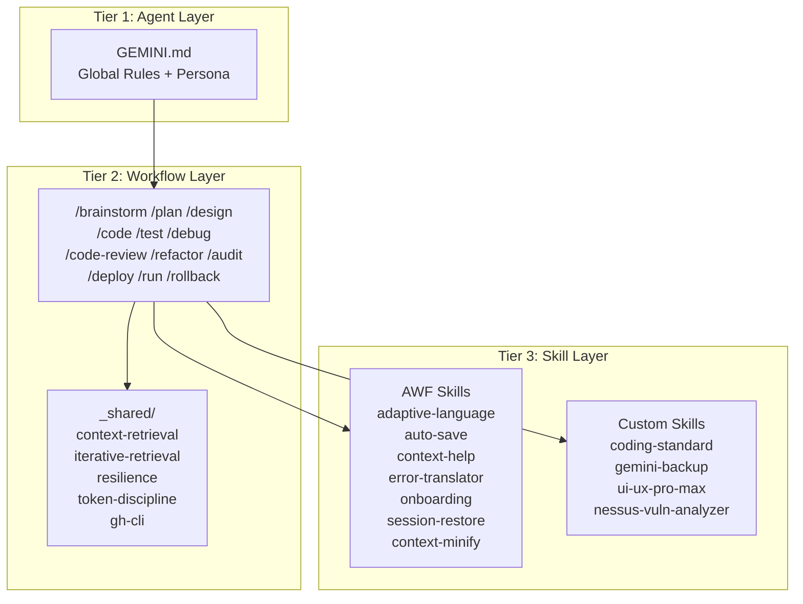
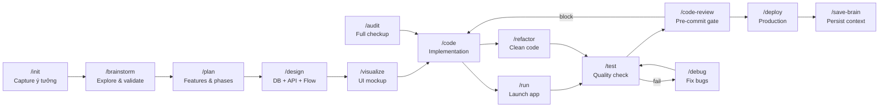
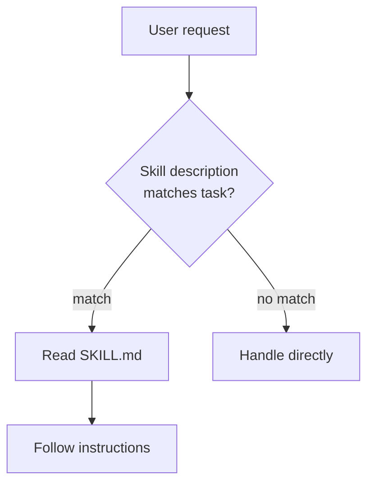
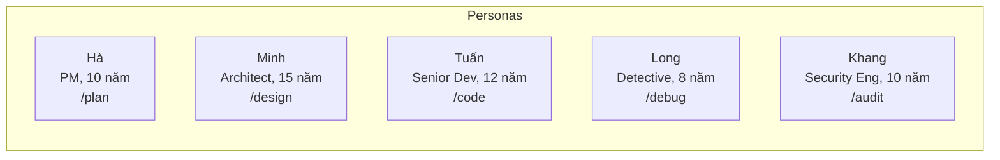
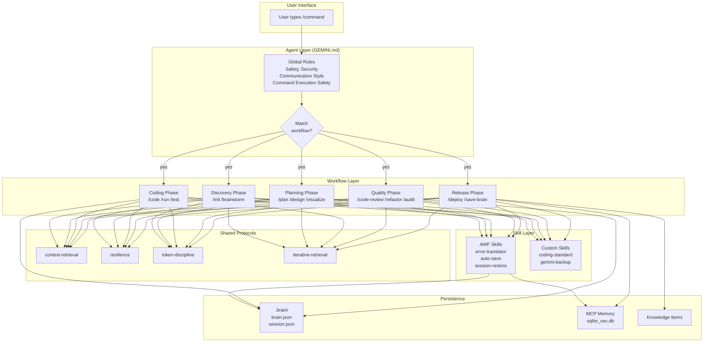

# Antigravity Workflow Framework (AWF) — Tài Liệu Chi Tiết

> **Phiên bản:** v4.0+ (2026-03-16)

---

## 1. Giới Thiệu

### AWF là gì?

**Antigravity Workflow Framework (AWF)** là hệ thống prompt engineering framework biến AI coding assistant thành một **đội ngũ phát triển phần mềm hoàn chỉnh**. Mỗi workflow là một persona chuyên biệt (PM, Developer, Designer, Detective, Auditor...) với quy trình, checklist, và guardrails riêng.

### Triết lý cốt lõi

```
AI ĐỀ XUẤT → User DUYỆT → AI THỰC THI → AI TỰ KIỂM TRA
```

| Nguyên tắc | Giải thích |
| --- | --- |
| **AI-First Proposal** | AI đề xuất giải pháp trước, user chỉ cần approve/adjust |
| **Persona-Driven** | Mỗi workflow có nhân vật riêng, tính cách riêng, expertise riêng |
| **Context Never Lost** | Lazy Checkpoint + Proactive Handover + MCP Memory = không mất context |
| **Non-Tech Friendly** | Mọi workflow đều hỗ trợ người dùng không biết kỹ thuật |
| **Anti-Rationalization** | Bảng chống bào chữa ép AI tuân thủ process, không skip bước |

### Tại sao cần AWF?

**Vấn đề:** AI coding assistant trả lời đúng nhưng **thiếu quy trình** — không review code, không test, không backup, không xử lý edge cases.

**Giải pháp:** AWF biến mỗi tác vụ thành workflow có cấu trúc, với phases rõ ràng, checklist chi tiết, và safety guardrails.

---

## 2. Kiến Trúc Tổng Quan

### 2.1. Directory Structure

```
~/.gemini/
├── GEMINI.md                          # Global rules (persona, safety, standards)
├── antigravity/
│   ├── global_workflows/              # 29 workflow files
│   │   ├── _shared/                   # Shared protocols (5 files)
│   │   │   ├── context-retrieval.md   # Memory → KI → Logs priority
│   │   │   ├── iterative-retrieval.md # Large codebase search pattern
│   │   │   ├── gh-cli.md             # GitHub CLI/MCP mapping
│   │   │   ├── resilience.md         # Auto-retry, timeout, fallback
│   │   │   └── token-discipline.md   # Context optimization rules
│   │   ├── brainstorm.md
│   │   ├── plan.md
│   │   ├── design.md
│   │   ├── code.md
│   │   ├── test.md
│   │   ├── debug.md
│   │   ├── code-review.md
│   │   ├── refactor.md
│   │   ├── audit.md
│   │   ├── deploy.md
│   │   ├── ... (29 files total)
│   │   └── README.md                 # Workflow catalog
│   ├── skills/                        # Built-in AWF skills (7 dirs)
│   │   ├── awf-adaptive-language/     # Điều chỉnh terminology theo level
│   │   ├── awf-auto-save/             # Auto-save session context
│   │   ├── awf-context-help/          # Context-aware help
│   │   ├── awf-error-translator/      # Dịch lỗi thành ngôn ngữ dễ hiểu
│   │   ├── awf-onboarding/            # First-time user guide
│   │   ├── awf-session-restore/       # Lazy-loading context restore
│   │   └── context-minify/            # Minify source for token saving
│   ├── schemas/                       # JSON schemas
│   │   ├── brain.schema.json
│   │   ├── session.schema.json
│   │   └── preferences.schema.json
│   ├── templates/                     # Templates
│   │   ├── brain.example.json
│   │   ├── session.example.json
│   │   └── preferences.example.json
│   ├── knowledge/                     # Knowledge Items (KI) database
│   ├── brain/                         # Conversation artifacts
│   └── mcp_config.json               # MCP server configuration
├── skills/                            # Custom user skills (10 dirs)
│   ├── coding-standard/
│   ├── gemini-backup/
│   ├── ui-ux-pro-max/
│   ├── nessus-vuln-analyzer/
│   └── ...
└── memory-db/
    └── sqlite_vec.db                  # MCP Memory vector database
```

### 2.2. 3-Tier Architecture



**Cách hoạt động:**
1. **GEMINI.md** (Tier 1) set global rules: persona, safety, coding standards
2. **Workflows** (Tier 2) define quy trình cụ thể cho từng tác vụ
3. **Skills** (Tier 3) cung cấp chuyên môn sâu, được gọi khi cần

---

## 3. Developer Cycle — Luồng Phát Triển

### 3.1. Full Development Flow



### 3.2. Các Luồng Thường Dùng

| Scenario | Flow |
| --- | --- |
| **Dự án mới** | `/init` → `/brainstorm` → `/plan` → `/design` → `/visualize` → `/code` → `/test` → `/deploy` |
| **Bắt đầu ngày** | `/recap` → `/code` → `/run` → `/test` → `/save-brain` |
| **Gặp bug** | `/debug` → `/test` → (nếu loạn) `/rollback` |
| **Trước release** | `/audit` → `/code-review` → `/test` → `/deploy` → `/save-brain` |
| **Dọn dẹp code** | `/refactor` → `/test` → `/save-brain` |

---

## 4. Danh Sách Workflows (29 files)

### 4.1. Core Development Workflows (10)

| Workflow | Persona | Mô tả | Anti-Rationalization |
| --- | --- | --- | --- |
| `/init` | Project Initializer | Capture ý tưởng, tạo workspace cơ bản | — |
| `/brainstorm` | Research Analyst | Explore ý tưởng, validate, tạo BRIEF.md | ✅ Anti-Skip, Scope Check, YAGNI |
| `/plan` | Hà (PM, 10 năm) | Features, phases, risk assessment | ✅ 6 excuses |
| `/design` | Minh (Architect, 15 năm) | DB schema, API, luồng hoạt động, test cases | — |
| `/code` | Tuấn (Senior Dev, 12 năm) | Implementation, Search-First, Phase Gate | ✅ 7 excuses |
| `/test` | QA Engineer | Test strategy, flaky detection, coverage | ✅ 6 excuses |
| `/debug` | Long (Detective, 8 năm) | Root cause investigation, hypothesis testing | ✅ Iron Law + 6 excuses + 5 red flags |
| `/code-review` | Code Reviewer | Pre-commit gate, security checklist, verdict | ✅ Receiving Protocol, Anti-Performative |
| `/refactor` | Code Gardener | Readability cleanup, safety tiers | ✅ 6 excuses |
| `/audit` | Khang (Security Eng, 10 năm) | Full checkup, grading A-F, fix-all mode | — (grading system = self-enforcing) |

### 4.2. Operations Workflows (6)

| Workflow | Mô tả |
| --- | --- |
| `/run` | Auto-detect build system, launch app, port conflict resolution |
| `/deploy` | Full production guide: SEO, analytics, legal, backup, monitoring, SSL |
| `/rollback` | Emergency recovery via git |
| `/recap` | Context recovery from `.brain/` files |
| `/save-brain` | Persist knowledge to `brain.json` + `session.json` + KI extraction |
| `/review` | Project overview & handover document |

### 4.3. Utility & Custom Workflows (13)

| Workflow | Mô tả |
| --- | --- |
| `/help` | Context-aware help system |
| `/next` | "Không biết làm gì tiếp?" — AI suggest next action |
| `/customize` | Preferences management (technical level, tone, autonomy) |
| `/visualize` | UI/UX mockup generation |
| `/design-system` | Design DNA + UI component library |
| `/mcp` | MCP server management |
| `/backup-gemini` | Backup `~/.gemini` lên GitHub |
| `/restore-gemini` | Restore từ backup |
| `/awf-update` | Cập nhật AWF phiên bản mới |
| `/cloudflare-tunnel` | Quản lý Cloudflare Tunnel |
| `/convert-dhi` | Convert Dockerfile to DHI format |
| `/gen-dockerfile` | Secure Docker Architect |
| `/save_brain` | Save project knowledge (alias) |

---

## 5. Shared Protocols (`_shared/`)

Mỗi shared file là một **micro-protocol** được tham chiếu bởi nhiều workflows.

### 5.1. context-retrieval.md

**Purpose:** Thứ tự ưu tiên khi tìm context từ sessions trước.

```
1. MCP Memory Service (recall_memory, retrieve_memory, search_by_tag)
2. Knowledge Items (KI summaries + artifacts)
3. Conversation Summaries
4. Conversation Logs (chỉ khi 1-3 không đủ)
```

### 5.2. iterative-retrieval.md

**Purpose:** Tìm context trong large codebases (30+ files).

```
DISPATCH → EVALUATE → REFINE → LOOP
```

- Bắt đầu rộng (grep, find) → Score candidates → Thu hẹp → Lặp nếu cần
- Tối ưu: không đọc full file, dùng context-minify

### 5.3. resilience.md

**Purpose:** Xử lý failures tự động, ẩn khỏi user.

- **Auto-retry:** 3 lần (1s → 2s → 4s exponential backoff)
- **Timeout:** Default 5 min (deploy: 10 min)
- **Error simplification:** Technical error → plain language
- **Fallback menu:** Numbered options khi persistent failure

### 5.4. token-discipline.md

**Purpose:** Tiết kiệm context window.

- Large files (>200 lines) → `context-minify` script
- Output ≤ 5 lines per step
- Reference paths instead of copying content
- Bullets > prose, WHAT not WHY

### 5.5. gh-cli.md

**Purpose:** Mapping GitHub CLI ↔ MCP tools.

- MCP cho read-only (get_file_contents, search_issues)
- `gh` CLI cho mutations (create branch, create PR, push)

---

## 6. Skills System

### 6.1. Cấu Trúc Skill

```
skills/{skill-name}/
├── SKILL.md          # Main instructions (required)
├── scripts/          # Helper scripts
├── examples/         # Reference implementations
└── resources/        # Additional assets
```

### 6.2. AWF Built-in Skills (7)

Prefix `awf-*` = auto-activated by workflows.

| Skill | Trigger | Mô tả |
| --- | --- | --- |
| `awf-adaptive-language` | Reads `preferences.json` | Điều chỉnh terminology theo technical level |
| `awf-auto-save` | Workflow end, context >80% | Tự động save session để tránh mất context |
| `awf-context-help` | `/help` hoặc user confused | Context-aware help dựa trên workflow hiện tại |
| `awf-error-translator` | Error detected | Dịch technical errors thành ngôn ngữ dễ hiểu |
| `awf-onboarding` | First `/init` | Hướng dẫn user mới |
| `awf-session-restore` | Session start | Lazy-loading context restore (3 levels) |
| `context-minify` | Large file reads | Minify source code: strip comments, docstrings → save ~40-60% tokens |

### 6.3. Custom User Skills (10)

| Skill | Mô tả |
| --- | --- |
| `coding-standard` | YAGNI, DRY, KISS enforcement |
| `gemini-backup` | Backup/restore `~/.gemini` to GitHub |
| `ui-ux-pro-max` | Premium UI design patterns |
| `nessus-vuln-analyzer` | Security vulnerability scanner |
| `memory-manager` | MCP Memory management |
| `database-migrations` | DB migration patterns |
| `python-patterns` | Python best practices |
| `standard-workflows` | Workflow templates |
| `tech-guide` | Technology guides |
| `find-skills` | Skills CLI (npx skills) |

### 6.4. Khi Nào Skill Được Gọi?



**Rule:** Khi một task match với skill description, agent PHẢI đọc `SKILL.md` trước khi proceed.

---

## 7. Persona System

Mỗi workflow có persona riêng — tạo trải nghiệm nhất quán và chuyên nghiệp.



| Persona | Workflow | Traits | Communication |
| --- | --- | --- | --- |
| **Hà** | /plan | User-first, "Do less, do well" | Offer 2-3 options, no jargon |
| **Minh** | /design | Giải thích kỹ thuật bằng đời thường | Ví dụ trước, thuật ngữ sau |
| **Tuấn** | /code | Careful, explains reasoning | Hide tech for non-tech users |
| **Long** | /debug | Calm, curious, methodical | "Let me check..." never rush |
| **Khang** | /audit | Meticulous, serious but not alarming | Medical metaphors, always pairs problems with solutions |

---

## 8. Non-Tech Mode

AWF hỗ trợ 3 technical levels, đọc từ `preferences.json`:

| Level | Behavior |
| --- | --- |
| **Newbie** | Ẩn chi tiết kỹ thuật, dùng emoji, 1 question per turn |
| **Basic** | Text + Mermaid diagrams with explanation |
| **Technical** | Full technical output |

**Mỗi workflow có bảng dịch riêng.** Ví dụ `/debug`:

| Error | Non-Tech Explanation |
| --- | --- |
| `ECONNREFUSED` | Database chưa chạy → Khởi động lại |
| `Cannot read undefined` | Đọc cái chưa có → Kiểm tra biến |
| `CORS error` | Server chặn browser → Cấu hình server |

---

## 9. Anti-Rationalization System

> Lấy cảm hứng từ **Superpowers** framework, adapt cho AWF context.

**Mục đích:** Ngăn AI skip process bằng cách liệt kê các "excuses" phổ biến và block chúng.

### Coverage

| Workflow | Excuses | Highlights |
| --- | --- | --- |
| `/brainstorm` | 1 (Anti-Skip) | "Simple project" vẫn cần BRIEF |
| `/plan` | 6 | "Skip Risk Assessment", "User wants everything in MVP" |
| `/code` | 7 | "I already know how to build this", "Skip Search-First" |
| `/test` | 6 | "Just CSS change", "Flaky test, just re-run" |
| `/debug` | 6 + 5 red flags | **Iron Law:** no fix without root cause |
| `/code-review` | Anti-Performative | Cấm "Great point!", YAGNI check on feedback |
| `/refactor` | 6 | "Fix bug while refactoring" = NEVER mix concerns |

### Pattern

```markdown
## Anti-Rationalization

If you catch yourself thinking any of these — STOP:

| Excuse | Reality |
| ------ | ------- |
| "[common shortcut]" | [why it's wrong] |
```

---

## 10. Context Management

### 10.1. Structured Context (`.brain/`)

```
.brain/
├── brain.json        # Static project knowledge (ít thay đổi)
├── session.json      # Dynamic session state (thay đổi liên tục)
└── preferences.json  # User preferences (local override)
```

| File | Chứa gì | Update khi nào |
| --- | --- | --- |
| `brain.json` | project info, tech stack, DB schema, API endpoints, features | Project thay đổi cấu trúc |
| `session.json` | working_on, pending_tasks, recent_changes, errors | Mỗi task/phase |
| `preferences.json` | technical_level, tone, autonomy, custom_rules | User chỉnh `/customize` |

### 10.2. Lazy Checkpoint

| Trigger | Action | Token Cost |
| --- | --- | --- |
| After each TASK | Append 1 line `session_log.txt` | ~20 |
| After each PHASE | Update `session.json` + `plan.md` | ~450 |
| Context >80% | Proactive Handover | ~500 |
| End of session | Update `brain.json` (if needed) | ~400 |

### 10.3. Context Recovery Priority

```
1. MCP Memory Service (recall_memory, retrieve_memory)
2. Knowledge Items (KI summaries + artifacts)
3. Conversation Summaries
4. Conversation Logs (ONLY when 1-3 insufficient)
```

---

## 11. Mermaid: Toàn Cảnh Workflow Interaction



---

## 12. Sử Dụng AWF

### 12.1. Cài Đặt

AWF được cài đặt tại `~/.gemini/antigravity/`. Trình Antigravity tự động nhận workflows khi khởi động.

### 12.2. Lệnh Cơ Bản

```bash
# Bắt đầu dự án mới
/init

# Không biết làm gì tiếp?
/next

# Cần help?
/help

# Tùy chỉnh persona/level
/customize
```

### 12.3. Workflow Chaining

Workflows tự động suggest bước tiếp theo. Ví dụ sau `/test`:

```
1. Tests pass? → /deploy
2. Tests fail? → /debug
3. Want more tests? → /code
```

### 12.4. Backup/Restore

```bash
# Backup cấu hình lên GitHub
/backup-gemini

# Restore sau AWF update
/restore-gemini

# So sánh local vs upstream
# (dùng gemini-backup skill diff command)
```

---

## 13. Kết Luận

AWF biến AI coding assistant từ "trả lời câu hỏi" thành **đội ngũ phát triển phần mềm có quy trình**:

- **29 workflows** covering full development lifecycle
- **7 personas** cho trải nghiệm nhất quán
- **12 skills** (7 built-in + custom) cho chuyên môn sâu
- **5 shared protocols** cho cross-cutting concerns
- **Anti-Rationalization** trên 7 workflows chống AI skip bước
- **Non-Tech Mode** hỗ trợ mọi trình độ
- **Context management** không mất context giữa sessions

> *Antigravity Workflow Framework — Your dreams, our engineering.*
