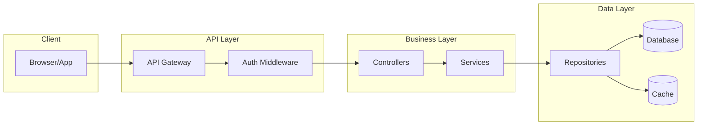
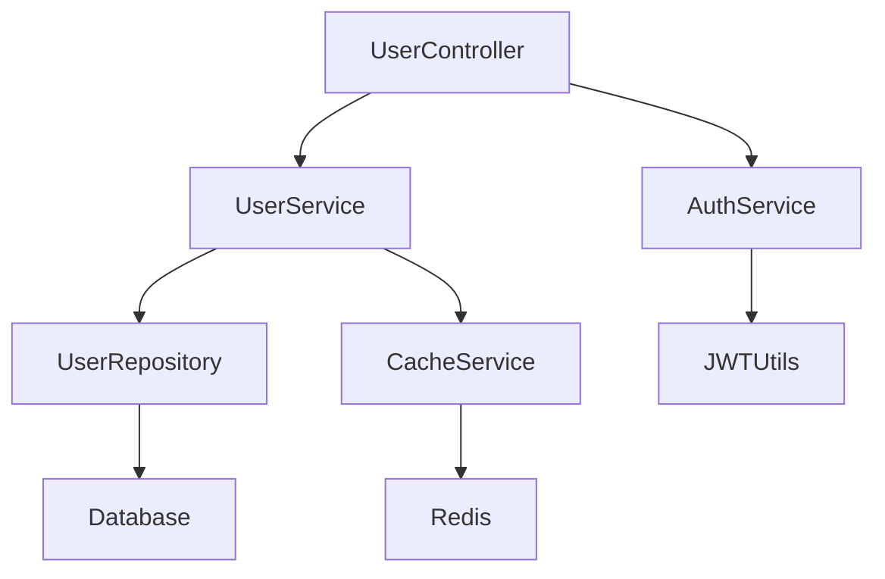

# 📁 CODEBASE.md - AI Agent Context Anchor

> **Purpose:** Giảm hallucination cho AI agents khi làm việc với codebase này.
> **Last Updated:** [DATE]
> **Updated By:** [AGENT/USER]

---

## 🚀 Quick Overview

| Attribute           | Value                                            |
| ------------------- | ------------------------------------------------ |
| **Project Name**    | [Tên project]                                    |
| **Tech Stack**      | [VD: Python 3.11, FastAPI, PostgreSQL, Redis]    |
| **Architecture**    | [Monolith / Microservices / Serverless / Hybrid] |
| **Entry Point**     | [VD: `main.py`, `src/app.py`]                    |
| **Package Manager** | [VD: pip, poetry, npm, pnpm]                     |
| **Build Tool**      | [VD: Make, Docker, Vite]                         |

---

## 🗂️ Directory Structure

```
project-root/
├── src/                    # [Mô tả ngắn]
│   ├── api/                # REST/GraphQL endpoints
│   ├── core/               # Business logic
│   ├── models/             # Data models / ORM
│   ├── services/           # External service integrations
│   └── utils/              # Helper functions
├── tests/                  # Test files
├── docs/                   # Documentation
├── scripts/                # Build/Deploy scripts
├── config/                 # Configuration files
└── docker/                 # Docker-related files
```

---

## 🔑 Key Modules

| Module         | Path                   | Purpose            | Key Classes/Functions              |
| -------------- | ---------------------- | ------------------ | ---------------------------------- |
| Authentication | `src/core/auth.py`     | User auth & JWT    | `AuthService`, `verify_token()`    |
| Database       | `src/core/database.py` | DB connection pool | `DatabaseService`, `get_session()` |
| API Routes     | `src/api/routes.py`    | Route registration | `register_routes()`                |
| [Add more...]  |                        |                    |                                    |

---

## 🔄 Data Flow Diagram



---

## 🔗 Dependencies Map



**External Dependencies:**
| Service | Purpose | Config Location |
|---------|---------|-----------------|
| PostgreSQL | Primary database | `.env` → `DATABASE_URL` |
| Redis | Caching, sessions | `.env` → `REDIS_URL` |
| [External API] | [Purpose] | `.env` → `API_KEY` |

---

## ⚠️ Gotchas & Conventions

### ❌ DO NOT:

- [ ] Sửa file `src/legacy/` - deprecated nhưng còn production dependency
- [ ] Commit file `.env` - secrets management
- [ ] Bypass auth middleware cho bất kỳ route nào

### ✅ MUST DO:

- [ ] Mọi API endpoint phải qua `@require_auth` decorator
- [ ] Database migrations phải có rollback script
- [ ] Log format: `[LEVEL] [MODULE] message`

### 📝 Naming Conventions:

- Files: `snake_case.py`
- Classes: `PascalCase`
- Functions/Variables: `snake_case`
- Constants: `UPPER_SNAKE_CASE`
- API routes: `kebab-case`

---

## 📝 Recent Changes

| Date       | Change Type                    | Description  | Files Affected  |
| ---------- | ------------------------------ | ------------ | --------------- |
| YYYY-MM-DD | `[NEW/MODIFY/DELETE/REFACTOR]` | [Mô tả ngắn] | `path/to/files` |
|            |                                |              |                 |

---

## 🧪 Testing Strategy

| Test Type   | Location             | Run Command                |
| ----------- | -------------------- | -------------------------- |
| Unit Tests  | `tests/unit/`        | `pytest tests/unit`        |
| Integration | `tests/integration/` | `pytest tests/integration` |
| E2E         | `tests/e2e/`         | `npm run test:e2e`         |

---

## 🚀 Build & Deploy

```bash
# Development
[command to run dev server]

# Production Build
[command to build]

# Deploy
[command or reference to deploy docs]
```

---

## 📚 Related Documentation

- [README.md](./README.md) - Getting started
- [docs/API.md](./docs/API.md) - API documentation
- [docs/ARCHITECTURE.md](./docs/ARCHITECTURE.md) - Detailed architecture
- [CONTRIBUTING.md](./CONTRIBUTING.md) - Contribution guidelines

---

> **⚡ Agent Instructions:**
>
> 1. Đọc file này TRƯỚC KHI làm bất kỳ thay đổi nào
> 2. Cập nhật "Recent Changes" sau mỗi feature lớn
> 3. Khi không chắc về cấu trúc → Hỏi user, KHÔNG đoán
